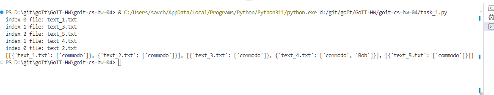
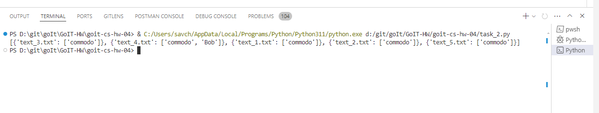

# Task 1

1. Реалізація багатопотокового підходу до обробки файлів (використовуючи threading):

Розділіть список файлів між різними потоками.
Кожен потік має шукати задані ключові слова у своєму наборі файлів.
Зберіть і виведіть результати пошуку з усіх потоків.

# Task 2

2. Реалізація багатопроцесорного підходу до обробки файлів (використовуючи multiprocessing):

Розділіть список файлів між різними процесами.
Кожен процес має обробляти свою частину файлів, шукаючи ключові слова.
Використайте механізм обміну даними (наприклад, через Queue) для збору та виведення результатів пошуку.

